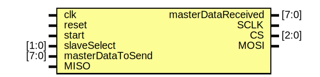

# Entity: Master
## Diagram

## Description

## Generics and ports
### Table 1.1 Generics
### Table 1.2 Ports
| Port name          | Direction | Type  | Description |
| ------------------ | --------- | ----- | ----------- |
| clk                | input     |       |             |
| reset              | input     |       |             |
| start              | input     |       |             |
| slaveSelect        | input     | [1:0] |             |
| masterDataToSend   | input     | [7:0] |             |
| masterDataReceived | output    | [7:0] |             |
| SCLK               | output    |       |             |
| CS                 | output    | [0:2] |             |
| MOSI               | output    |       |             |
| MISO               | input     |       |             |
## Signals, constants and types
### Signals
| Name    | Type      | Description |
| ------- | --------- | ----------- |
| counter | integer   |             |
| flag    | reg       |             |
| buffer  | reg [7:0] |             |
## Processes
- **unnamed**: ***( @(posedge start ) )***

- **unnamed**: ***( @(posedge SCLK or posedge reset) )***

- **unnamed**: ***( @(negedge SCLK) )***

