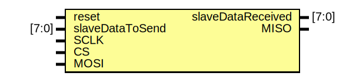

# Entity: Slave
## Diagram

## Description

## Generics and ports
### Table 1.1 Generics
### Table 1.2 Ports
| Port name         | Direction | Type  | Description |
| ----------------- | --------- | ----- | ----------- |
| reset             | input     |       |             |
| slaveDataToSend   | input     | [7:0] |             |
| slaveDataReceived | output    | [7:0] |             |
| SCLK              | input     |       |             |
| CS                | input     |       |             |
| MOSI              | input     |       |             |
| MISO              | output    |       |             |
## Signals, constants and types
### Signals
| Name     | Type      | Description |
| -------- | --------- | ----------- |
| Reg_Data | reg [7:0] |             |
## Processes
- **unnamed**: ***( @(negedge CS) )***

- **unnamed**: ***( @(posedge CS) )***

- **unnamed**: ***( @(posedge SCLK or posedge reset) )***

- **unnamed**: ***( @(negedge SCLK) )***

